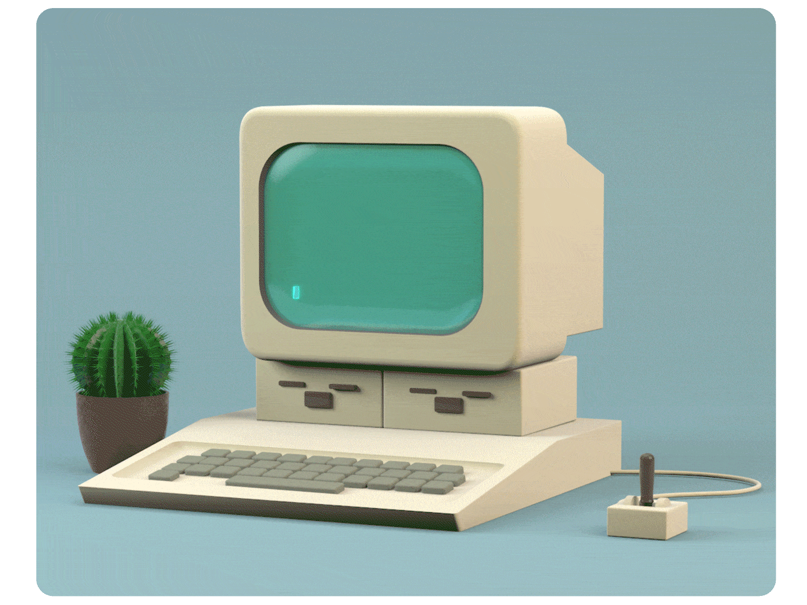

  <ul style="list-style: none;">
    

      
      <h1>Hi, I'm Mia!</h1>
    

  </ul>

> Third-year Mathematics student at the University of Waterloo

- 💻 Previous Software Development Intern at [Netsweeper](https://www.netsweeper.com/), 
  [Brock Solutions](https://www.brocksolutions.com/), and [BlackBerry](https://www.blackberry.com/us/en)
- 📚 Majoring in Combinatorics and Optimization
- 👋 Feel free to connect with me on [LinkedIn](https://www.linkedin.com/in/miaisakovic/)

<!--
**miaisakovic/miaisakovic** is a ✨ _special_ ✨ repository because its `README.md` (this file) appears on your GitHub profile.

Here are some ideas to get you started:

- 🔭 I’m currently working on ...
- 🌱 I’m currently learning ...
- 👯 I’m looking to collaborate on ...
- 🤔 I’m looking for help with ...
- 💬 Ask me about ...
- 📫 How to reach me: ...
- 😄 Pronouns: ...
- ⚡ Fun fact: ...
-->
